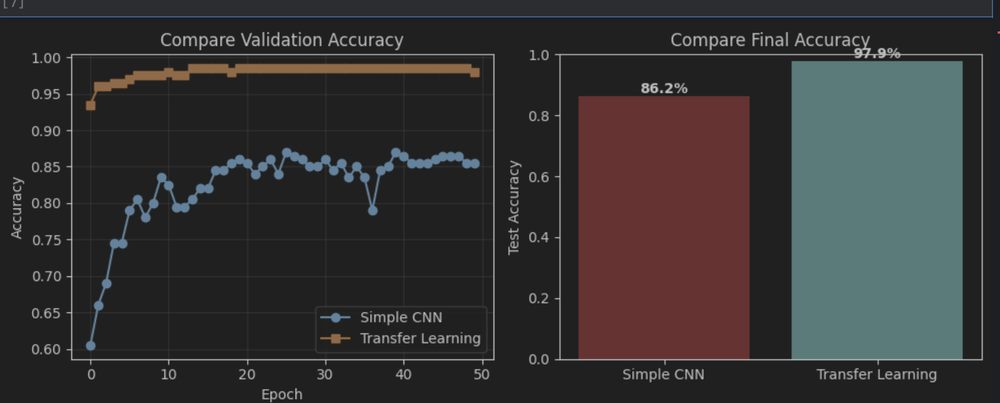
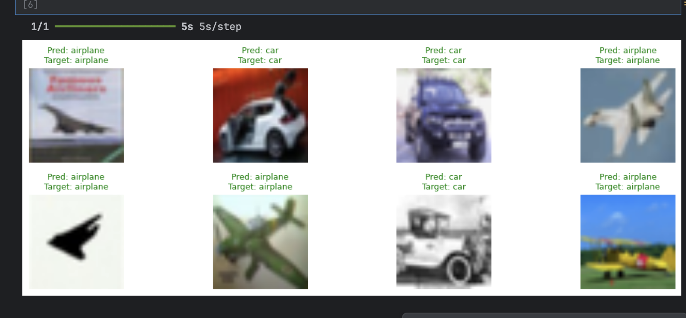

# 🧠 CIFAR-10 Transfer Learning vs Simple CNN

A deep-learning project comparing the performance of a **Simple CNN** and a **Transfer Learning model (MobileNetV2)** on a binary subset of the **CIFAR-10 dataset**  
(airplane ✈️ vs car 🚗).

---

## 🎥 Preview & Screenshot

<table align="center">
  <tr>
    <td align="center">
      </img>
       🎬  (Transfer Learning)
    </td>

  </tr>
</table>

<table align="center">
  <tr>
    <td align="center">
      
       📊  
    </td>
  </tr>
</table>

---

## 🧩 Project Overview

This project demonstrates the power of **Transfer Learning** compared to a custom-built **Convolutional Neural Network (CNN)**.  
Both models are trained on a filtered CIFAR-10 dataset containing only **two classes: airplane (0)** and **car (1)**.

The workflow includes:
1. **Data preprocessing** (resizing, normalization, binary filtering)  
2. **Simple CNN training**  
3. **Transfer learning using MobileNetV2**  
4. **Fine-tuning top layers**  
5. **Comparison of performance metrics and training time**

---

## ⚙️ Technologies Used

| Component | Description |
|------------|--------------|
| **TensorFlow / Keras** | Model building and training |
| **MobileNetV2** | Pretrained feature extractor |
| **CIFAR-10 dataset** | Airplane vs Car binary classification |
| **Matplotlib** | Visualization of accuracy and prediction results |
| **NumPy** | Data handling and preprocessing |

---

## 🚀 Training Steps

### 🔹 Step 1 — Simple CNN  
A baseline convolutional model with three Conv2D layers, MaxPooling, and Dense output.  
Trained from scratch on resized CIFAR-10 images (96×96).

### 🔹 Step 2 — Transfer Learning  
A MobileNetV2 model imported with pretrained ImageNet weights.  
Trained in two stages:
- **Feature Extraction:** Frozen base model
- **Fine-Tuning:** Unfreezing top 10 layers with a smaller learning rate (1e-5)

---

## 📈 Results Summary

| Model | Test Accuracy | Train Time (sec) | Parameters |
|-------|----------------|------------------|-------------|
| 🧩 Simple CNN | ~XX% | ~XXs | ~0.7 M |
| 🚀 MobileNetV2 Transfer | ~XX% | ~XXs | ~2.3 M |

*(Replace with your actual measured results from the console)*

---

## 🖼️ Example Predictions

  

Green titles = ✅ correct predictions  
Red titles = ❌ incorrect predictions

---

## 📘 Key Learnings

- Transfer learning achieves **higher accuracy** with **fewer training epochs**
- Feature extraction saves time while keeping strong performance
- Fine-tuning top layers yields additional improvements
- Visualizing learning curves clearly shows convergence speed

---

## 👨‍💻 Author

Developed by **Ismoil**  
GitHub: [@ismoil201](https://github.com/ismoil201)
# Transfer_Learing_ML
